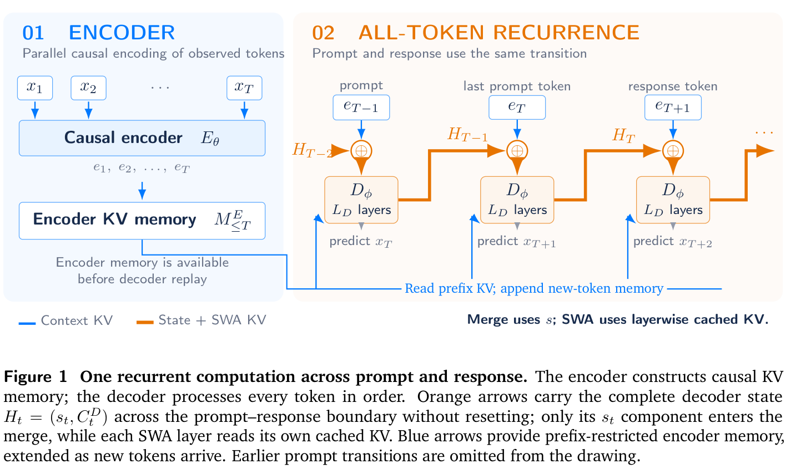

</img>

## RLT (Recurrent Looped Transformer)

Unofficial implementation of the [Recurrent Looped Transformer](https://yifanzhang-pro.github.io/recurrent-looped-tranformer/) proposed by Yifan Zhang of Princeton.

Will also do some exploration of the [Recurrent Transformer](https://arxiv.org/abs/2604.21215) proposed by Costin-Andrei Oncescu et al. of Harvard, if I have any remaining time

## Install

```bash
$ pip install rlt-pytorch
```

## Usage

```python
import torch
from RLT import RLT

model = RLT(
    num_tokens = 256,
    dim = 512,
    enc_depth = 4,
    dec_depth = 4,
    dec_sliding_window_size = 16,
    tbptt_step_size = 16 # optional truncated bptt
)

tokens = torch.randint(0, 256, (2, 1024))

# forward for loss

loss = model(tokens, return_loss = True)
loss.backward()

# generate

prompt = torch.randint(0, 256, (2, 32))

sampled = model.generate(prompt, max_len = 128) # (2, 96)
```

## Test

Train on enwik8

```bash
$ uv run train_enwik8.py
```

## Citations

```bibtex
@techreport{zhang2026recurrentlooped,
    title  = {Recurrent Looped Transformer},
    author = {Zhang, Yifan},
    year   = {2026},
    month  = {Sep},
    url    = {https://github.com/yifanzhang-pro/recurrent-looped-tranformer}
}
```

```bibtex
@misc{oncescu2026recurrenttransformergreatereffective,
    title     = {The Recurrent Transformer: Greater Effective Depth and Efficient Decoding},
    author    = {Costin-Andrei Oncescu and Depen Morwani and Samy Jelassi and Alexandru Meterez and Mujin Kwun and Sham Kakade},
    year      = {2026},
    eprint    = {2604.21215},
    archivePrefix = {arXiv},
    primaryClass = {cs.LG},
    url       = {https://arxiv.org/abs/2604.21215},
}
```
